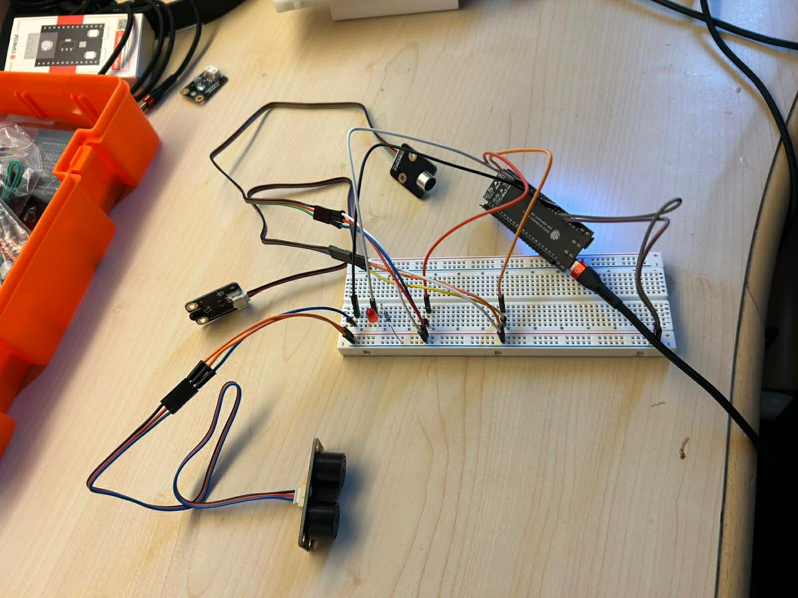

🔹 Système de Surveillance IoT basé sur ESP32 avec Flame, Ultrasonic et Capteur Sonore + ThingSpeak

1️⃣ Introduction

Ce projet consiste à concevoir un système de surveillance intelligent basé sur l’ESP32, capable de détecter la présence de flamme, mesurer la distance d’objets proches et analyser le niveau sonore ambiant, puis envoyer ces données vers une plateforme cloud (ThingSpeak) pour une visualisation en temps réel.

Ce projet s’inscrit dans le cadre de l’Internet des Objets (IoT) et illustre la communication entre un microcontrôleur et une plateforme cloud via Wi-Fi.

2️⃣ Objectifs du Projet

Les objectifs principaux de ce projet sont :

✔ Apprendre à utiliser l’ESP32
✔ Lire les données de plusieurs capteurs (flamme, distance, son)
✔ Transmettre les données via Internet
✔ Visualiser les données sur ThingSpeak
✔ Comprendre le fonctionnement des systèmes IoT

| Composant         | Rôle                                       |
| ----------------- | ------------------------------------------ |
| ESP32             | Microcontrôleur principal                  |
| Capteur de flamme | Détection d’incendie ou flamme             |
| Capteur Ultrason  | Mesure de distance des objets              |
| Capteur sonore    | Détection de bruit / son                   |
| LED               | Indicateur visuel (alerte flamme/distance) |
| Connexion WiFi    | Transmission des données                   |
| ThingSpeak        | Plateforme Cloud                           |

3️⃣ Bibliothèques Utilisées

Le programme utilise les bibliothèques suivantes :
| Bibliothèque | Fonction                                |
| ------------ | --------------------------------------- |
| WiFi.h       | Connexion de l’ESP32 à Internet         |
| HTTPClient.h | Envoi des requêtes HTTP vers ThingSpeak |

4️⃣ Schéma de Câblage

🔹 Capteur de flamme
| Broche Flamme | ESP32  |
| ------------- | ------ |
| VCC           | 5V     |
| GND           | GND    |
| OUT           | GPIO 6 |

🔹 Capteur Ultrason 3 broches (Trigger/Echo combiné)
| Broche Ultrason | ESP32   |
| --------------- | ------- |
| SIG             | GPIO 10 |
| VCC             | 5V      |
| GND             | GND     |

🔹 Capteur sonore

| Broche Sound AO | ESP32     |
| --------------- | --------- |
| AO              | GPIO 4    |
| VCC             | 3.3V / 5V |
| GND             | GND       |

🔹 LED
| LED     | ESP32                 |
| ------- | --------------------- |
| Anode   | GPIO 7                |
| Cathode | GND (avec résistance) |

5️⃣ Fonctionnement du Système

L’ESP32 se connecte au réseau WiFi.

Les capteurs collectent les données :

Flamme

Distance

Niveau sonore

Les données sont affichées sur le moniteur série.

Les données sont envoyées vers ThingSpeak toutes les 15 secondes.

6️⃣ Envoi des Données vers ThingSpeak

Les données sont envoyées via une requête HTTP :
http://api.thingspeak.com/update?api_key=API_KEY
&field1=Flame
&field2=Distance
&field3=Sound
| Champ ThingSpeak | Donnée                 |
| ---------------- | ---------------------- |
| Field 1          | Flamme (0 ou 1)        |
| Field 2          | Distance (cm)          |
| Field 3          | Niveau sonore (analogique) |

7️⃣ Résultats

✔ Détection correcte de flamme
✔ Mesure fiable de la distance
✔ Lecture du niveau sonore
✔ Transmission des données en temps réel sur ThingSpeak
✔ Visualisation des données sur graphiques ThingSpeak
✔ Système stable et prêt pour projets IoT

8️⃣ Conclusion

Ce projet démontre l’utilisation efficace de l’ESP32 pour un système de surveillance IoT multi-capteurs.
Il permet la collecte et la visualisation des données environnementales à distance, et constitue une excellente base pour :

Les projets académiques
Les systèmes de sécurité et surveillance
Les applications Smart Home et IoT

 