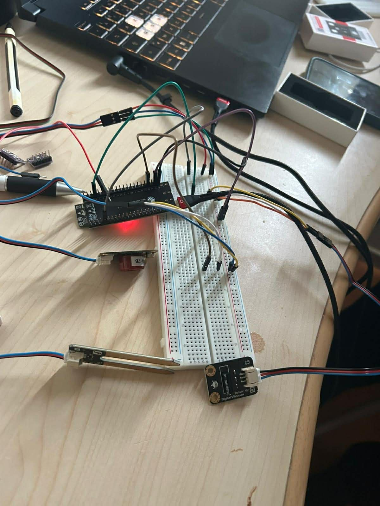

# 🔹 Système de Surveillance IoT – ESP32 avec Capteurs Gas, Soil et Vibration et Intégration ThingSpeak

## 1️⃣ Introduction

Ce projet consiste à concevoir un système de surveillance basé sur l’ESP32, capable de détecter des situations environnementales et de les envoyer vers une plateforme cloud (ThingSpeak) pour une visualisation en temps réel.

Le système permet de mesurer :

- La détection de gaz
- L’humidité du sol
- Les vibrations

Ce projet illustre la communication entre un microcontrôleur et une plateforme cloud via Wi-Fi et l’IoT appliqué à la surveillance environnementale.

## 2️⃣ Objectifs du Projet

Les objectifs principaux de ce projet sont :

✔ Apprendre à utiliser l’ESP32  
✔ Lire les données de plusieurs capteurs (digital et analogique)  
✔ Transmettre les données via Internet  
✔ Visualiser les données sur ThingSpeak  
✔ Comprendre le fonctionnement des systèmes IoT  

| Composant        | Rôle                                 |
| ---------------- | ----------------------------------- |
| ESP32            | Microcontrôleur principal           |
| Gas Sensor       | Détecteur de gaz                     |
| Soil Moisture    | Capteur d’humidité du sol (analog)   |
| Vibration Sensor | Détecteur de vibration               |
| Connexion WiFi   | Transmission des données             |
| ThingSpeak       | Plateforme Cloud                     |

## 3️⃣ Bibliothèques Utilisées

Le programme utilise les bibliothèques suivantes :

| Bibliothèque | Fonction                                |
| ------------ | --------------------------------------- |
| WiFi.h       | Connexion de l’ESP32 à Internet         |
| HTTPClient.h | Envoi des requêtes HTTP vers ThingSpeak |

4️⃣ Schéma de Câblage:
🔹 Capteur Gas
| Broche Gas | ESP32  |
| ---------- | ------ |
| DO         | GPIO 2 |
| VCC        | 5V   |
| GND        | GND    |

🔹 Capteur Soil Moisture
| Broche Soil | ESP32   |
| ----------- | ------- |
| Signal      | GPIO 13 |
| VCC         | 5V    |
| GND         | GND     |

🔹 Capteur Vibration (DFR0027)
| Broche Vibration | ESP32  |
| ---------------- | ------ |
| DO               | GPIO 4 |
| VCC              | 5V   |
| GND              | GND    |

5️⃣ Fonctionnement du Système

L’ESP32 se connecte au réseau WiFi (2,4 GHz uniquement).

Les capteurs collectent les données :

Gas Sensor → 1 = gaz détecté, 0 = pas de gaz

Soil Moisture → valeur analogique (0–4095), <1500 = sol sec

Vibration Sensor → 1 = vibration détectée, 0 = pas de vibration

Les données sont affichées sur le moniteur série.

Les données sont envoyées toutes les 15 secondes vers ThingSpeak.

6️⃣ Envoi des Données vers ThingSpeak

Les données sont envoyées via une requête HTTP GET :
http://api.thingspeak.com/update?api_key=API_KEY
&field1=Gas
&field2=Soil
&field3=Vibration

| Champ ThingSpeak | Donnée                   |
| ---------------- | ------------------------ |
| Field 1          | Gaz détecté (0/1)        |
| Field 2          | Humidité du sol          |
| Field 3          | Vibration détectée (0/1) |

7️⃣ Configuration ThingSpeak
Créer un compte sur ThingSpeak

Créer un channel pour ce projet.
Activer Field1, Field2 et Field3 pour Gas, Soil et Vibration.
Copier la Write API Key et la placer dans la variable apiKey du code.
String apiKey = "TON_WRITE_API_KEY";
Modifier les paramètres WiFi pour utiliser un réseau 2,4 GHz :
const char* ssid = "TON_SSID_2.4GHz";
const char* password = "TON_MOT_DE_PASSE";

Téléverser le code sur l’ESP32 via l’IDE Arduino.

8️⃣ Résultats

✔ Lecture correcte des capteurs
✔ Transmission des données en temps réel
✔ Visualisation sur graphiques ThingSpeak
✔ Système stable et fiable

9️⃣ Conclusion

Ce projet montre comment l’ESP32 peut être utilisé pour collecter et visualiser des données de plusieurs capteurs dans un système IoT.
Il constitue une base solide pour :

Les projets académiques

Les applications Smart Home

Les systèmes de surveillance environnementale IoT

 
