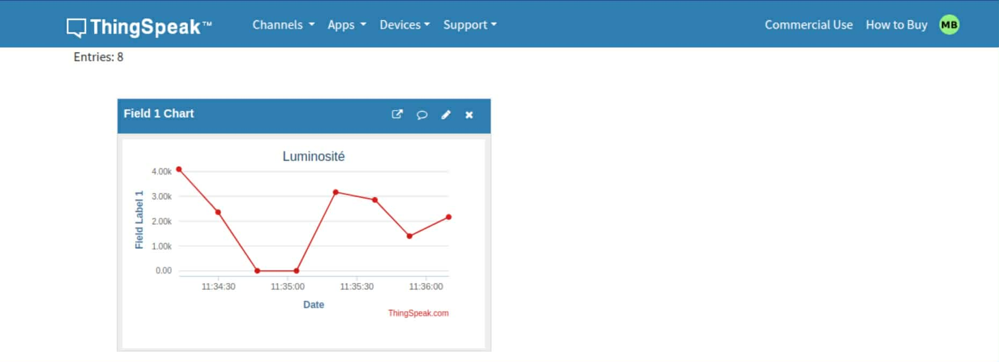

# LDR Sensor – ESP32 Project

## Description
Ce code lit la valeur d'un **capteur LDR** (luminosité) et contrôle une LED selon la lumière ambiante.

## Matériel
- ESP32
- LDR + résistance (pont diviseur)
- LED + résistance
      

## Connexion des composants
| LDR | ESP32 |
|-----|-------|
| VCC | 5V |
| GND | GND |
| Signal | GPIO 12 |

| LED | ESP32 |
|-----|-------|
| Anode | GPIO 2 |
| Cathode | GND (avec résistance) |

 

##Fonctionnement – DHT11 + ThingSpeak (from zero)

1-Créer un compte ThingSpeak
    Aller sur https://thingspeak.com
    Cliquer sur Sign Up et créer un compte gratuit

2-Créer un channel pour le DHT11
    Une fois connecté, cliquer sur Channels → My Channels → New Channel
    Nommer le channel, par exemple : ESP32 Light Sensor
    Activer Field 1 pour la luminosité mesurée
    Cliquer sur Save Channel

3-Récupérer la Write API Key
    Dans le channel, cliquer sur API Keys
    Copier la clé Write API Key (exemple : QFFVQ0KN51FUHFP7)
    
4-Modifier le code ESP32
   Dans ton code, tu dois configurer correctement le WiFi et la clé ThingSpeak pour que l’ESP32 fonctionne correctement. Voici comment faire :

        // ===== WiFi =====
        const char* ssid = "TON_SSID_2.4GHz";      // Remplace par le nom de ton réseau 2,4 GHz
        const char* password = "TON_MOT_DE_PASSE"; // Remplace par ton mot de passe WiFi

        // ===== ThingSpeak API Key =====
        String apiKey = "TON_WRITE_API_KEY";       // Remplace par ta Write API Key de ton channel ThingSpeak

4.1 – Modifier la bande WiFi pour ESP32
    Pourquoi modifier la bande WiFi:
        L’ESP32 ne supporte pas le 5 GHz.
        Même si ton réseau est visible sur les deux bandes (2,4 GHz et 5 GHz), l’ESP32 ne pourra se connecter qu’au 2,4 GHz.

5-Connecter le LDR et la LED à l’ESP32
    VCC → 5V
    DATA → GPIO 12
    LED → GPIO 2
    GND → GND

6-Téléverser le code sur l’ESP32
    Brancher l’ESP32 à l’ordinateur
    Ouvrir l’IDE Arduino
    Sélectionner la carte ESP32 correspondante et le port
    Cliquer sur Téléverser

7-Vérifier la communication
    Les données sont envoyées toutes les 15 secondes sur ThingSpeak
8-Voir les données sur ThingSpeak
    Aller sur le channel créé
    La valeur de Field1 (luminosité) est mise à jour en temps réel
    Tu peux créer des graphes ou exporter les données

9-Utiliser les données dans un autre projet

    Récupérer les données via HTTP GET en utilisant la Read API Key de ton channel
    Exemple d’URL pour lire les données JSON :
        https://api.thingspeak.com/channels/CHANNEL_ID/fields/1.json?api_key=READ_API_KEY&results=10

    Avec cette URL, tu peux :
        Intégrer les données dans une application web
        Créer des alertes ou tableaux de bord IoT
        Utiliser les données dans Arduino/ESP32 ou Raspberry Pi pour d’autres projets
        Lire les champs Field1  selon tes besoins

        
 