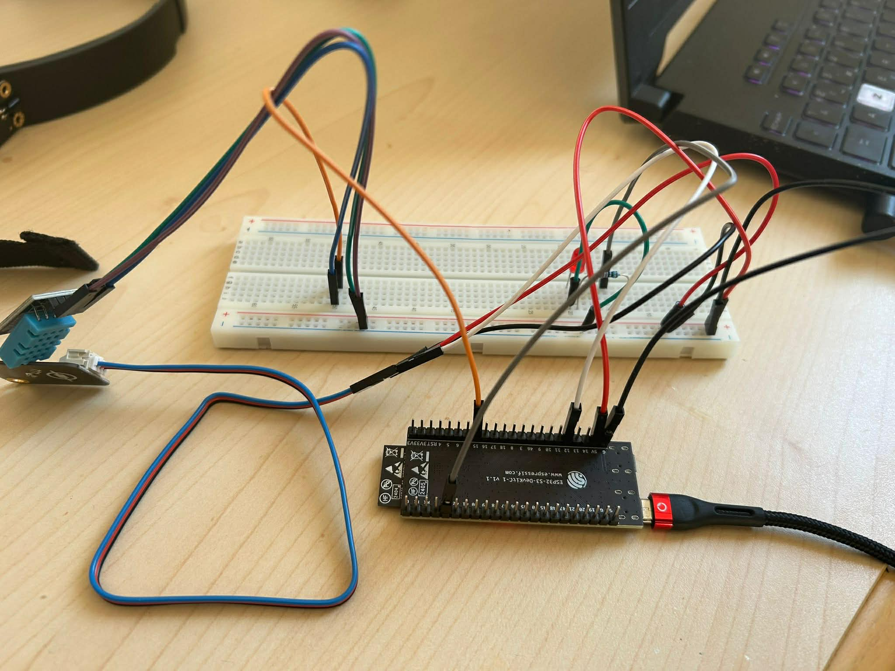

🔹 Système de Surveillance IoT basé sur ESP32 avec Intégration ThingSpeak

1️⃣ Introduction

Ce projet consiste à concevoir un système de surveillance intelligent basé sur l’ESP32, capable de collecter des données environnementales et de les envoyer vers une plateforme cloud (ThingSpeak) pour une visualisation en temps réel.

Le système permet de mesurer :

La température

L’humidité

La luminosité

La détection de mouvement

Ce projet s’inscrit dans le cadre de l’Internet des Objets (IoT) et illustre la communication entre un microcontrôleur et une plateforme cloud via Wi-Fi.

2️⃣ Objectifs du Projet

Les objectifs principaux de ce projet sont :

✔ Apprendre à utiliser l’ESP32

✔ Lire les données de plusieurs capteurs

✔ Transmettre les données via Internet

✔ Visualiser les données sur ThingSpeak

✔ Comprendre le fonctionnement des systèmes IoT

| Composant      | Rôle                               |
| -------------- | ---------------------------------- |
| ESP32          | Microcontrôleur principal          |
| DHT11          | Capteur de température et humidité |
| LDR            | Capteur de luminosité              |
| PIR            | Détecteur de mouvement             |
| LED            | Indicateur visuel                  |
| Connexion WiFi | Transmission des données           |
| ThingSpeak     | Plateforme Cloud                   |

4️⃣ Bibliothèques Utilisées

Le programme utilise les bibliothèques suivantes :
#include <WiFi.h>
#include <HTTPClient.h>
#include "DHT.h"

Rôle des bibliothèques :
| Bibliothèque | Fonction                        |
| ------------ | ------------------------------- |
| WiFi.h       | Connexion de l’ESP32 à Internet |
| HTTPClient.h | Envoi des requêtes HTTP         |
| DHT.h        | Lecture du capteur DHT11        |

5️⃣ Schéma de Câblage

🔹 Capteur PIR
| Broche PIR | ESP32  |
| ---------- | ------ |
| VCC        | 5V   |
| GND        | GND    |
| OUT        | GPIO 5 |

🔹 Capteur LDR
| LDR    | ESP32   |
| ------ | ------- |
| VCC    | 5V    |
| GND    | GND     |
| Signal | GPIO 12 |

🔹 Capteur DHT11
| DHT11 | ESP32   |
| ----- | ------- |
| VCC   | 5V    |
| DATA  | GPIO 15 |
| GND   | GND     |

🔹 LED
| LED     | ESP32                 |
| ------- | --------------------- |
| Anode   | GPIO 2                |
| Cathode | GND (avec résistance) |

6️⃣ Fonctionnement du Système
L’ESP32 se connecte au réseau WiFi

Les capteurs collectent les données :
Température
Humidité
Luminosité
Mouvement

Les données sont affichées sur le moniteur série
Elles sont envoyées vers ThingSpeak
Les valeurs sont mises à jour toutes les 15 secondes

7️⃣ Envoi des Données vers ThingSpeak

Les données sont envoyées via une requête HTTP :
http://api.thingspeak.com/update?api_key=API_KEY
&field1=LDR
&field2=Temperature
&field3=Humidity

| Champ ThingSpeak | Donnée      |
| ---------------- | ----------- |
| Field 1          | Luminosité  |
| Field 2          | Température |
| Field 3          | Humidité    |

8️⃣ Résultats

✔ Lecture correcte des capteurs
✔ Transmission des données en temps réel
✔ Visualisation sur graphiques ThingSpeak
✔ Système stable et fiable

9️⃣ Conclusion

Ce projet démontre l’utilisation efficace de l’ESP32 dans un système IoT.
Il permet la collecte et la visualisation des données environnementales à distance.
Il constitue une excellente base pour :
Les projets académiques
Les applications Smart Home
Les systèmes de surveillance IoT

 